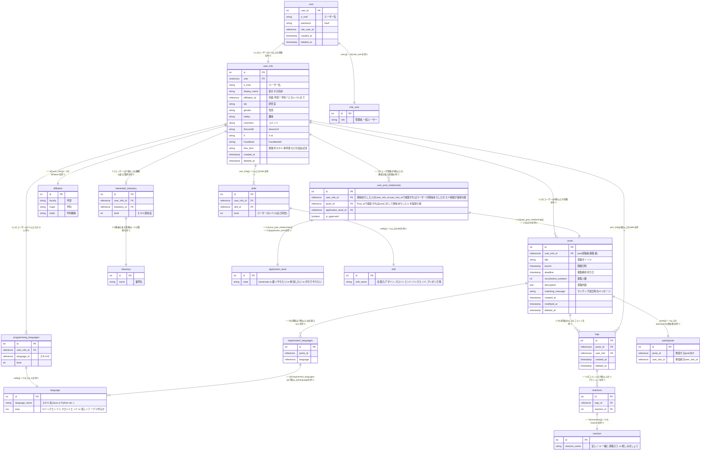

```mermaid
erDiagram
	user ||--|| user_info : "1人のユーザーは1つ以上の投稿を持つ"
    user ||--|| role_user : "userは一つのrole_userを持つ"
	posts ||--o{ logs : "1つの投稿は0以上のコメントを持つ"
	user_info ||--o{ posts : "1人のユーザーは0個以上の投稿を持つ"
	user_info ||--|{ programming_languages : "1人のユーザーは1つ以上のスキル持つ"
	programming_languages ||--|| language : "skillsは一つのスキルを持つ"
	user_info ||--o| interested_industory : "1つユーザーは０個以上の教務のある業界を持つ"
	user_info ||--|| affiliation : "一つのuser_infoは一つのaffiliationを持つ"
	interested_industory ||--|| industory : "1つ興味のある業界は一つの業界を持つ"
	logs ||--o{ reactions : "一つのコメントは０個以上のリアクションを持つ"
	reactions ||--|| reaction : "一つのreactionsは一つのreactionを持つ"
	posts ||--o{ requirement_languages : "一つの投稿は０個以上の必須スキルを持つ"
	requirement_languages ||--|{ language : "一つのrequirement_languagesは０個以上のlanguageを持つ"
	user_info ||--o{ user_post_relationship  : "一つのユーザ情報が0個以上の興味がある投稿を持つ"
	user_post_relationship ||--|| posts : "一つのuser_post_relationshipは一つのpostsを持つ"
 	user_post_relationship ||--|| application_level : "一つのuser_post_relationshipは一つのapplication_levelを持つ"
	posts ||--|| participants : "postsは一つ以上のparticipants(参加者)を持つ"
    	user_info ||--|{ skills : "user_infoは一つ以上のskillsを持つ"
    	skills ||--|| skill : "skillsは一つ以上のskillを持つ"
	user_info ||--o{ logs : "user_infoは0個以上のskillsを持つ"
 
 user {
  int user_id PK
  string e_mail "ユーザー名"
  string password "hash"
  reference role_user_id
  timestamp created_at
  timestamp deleted_at
 }

 role_user {
  int id PK
  string role "管理者,一般ユーザー"
 }

 user_info {
  int id PK
  rearences user PK
  string e_mail "ユーザー名"
  string display_name "表示する名前"
  reference affiliation_id "所属:学部？学科？どのレベルまで"
  string lab  "研究室"
  string gender "性別"
  string hobby "趣味"
  string comment "コメント"
  string DiscordID "discord id"
  string X "X id"
  strinig FaceBook "FaceBookID"
  string free_form "勉強中スキル,参考書などの自由記述"
  timestamp created_at
  timestamp deleted_at
 }

 affiliation {
  int id PK
  string faculty "学部"
  string major "学科"
  string initial "学科略称"
 }

 skills {
  int id PK
  reference user_info_id FK
  reference skill_id FK
  int level "ユーザーのレベル(自己申告)"
 }

 skill {
  int id PK
  string skill_name "企画力,デザイン,フロントエンド,バックエンド,プレゼン力等"
 }

 programming_languages {
  int id PK
  reference user_info_id FK
  reference language_id "スキルID"
  int level
 }

 language {
  int id PK
  string language_name "スキル名(Java or Python etc..)"
	ine area "0:バックエンド,1:フロントエンド or 新しくテーブル作るか"
 }

 interested_industory {
  int id PK
  reference user_info_id FK
  reference industory_id FK
  int level "スキル習熟度"
 }

 industory {
  int id PK
  string name "業界名"
 }

 posts {
  int id PK
  references user_info_id FK "post投稿者(募集者)"
  string title "投稿タイトル"
  timestamp launch "開催日時"
  timestamp deadline "募集締め切り日"
  int recruitment_numbers "募集人数"
  text description "投稿内容"
  string matching_message "マッチング成立時のメッセージ"
  timestamp created_at
  timestamp modifyed_at
  timestamp deleted_at
 }

 requirement_languages {
  int id PK
  reference ponts_id
  referemce language
 }

 logs {
  int id PK
  references posts_id FK
  references user_info FK
  timestamp created_at
  timestamp deleted_at
 }

 reactions {
  int id PK
  reference logs_id FK
  int reaction_id FK
 }

 reaction {
  int id PK
  string reaction_name "宜しく or 一緒に頑張ろう or 楽しみましょう"
 }

 user_post_relationship  {
  int id PK
  reference user_info_id FK "興味ありした人のUser_info_id.user_info_idで検索すればユーザーが興味ありしたポスト情報が取得可能"
  reference posts_id FK "Post_idで検索すればpostに対して興味ありした人を取得可能"
  refafrence application_level_id FK
  boolean is_approved
 }

 application_level {
  int id PK
  string state "bookmark or 緩くやりたい or 参加したい or がちでやりたい"
 }

 participants {
  int id PK
  reference posts_id "参加するpostのID"
  reference user_info_id "参加者のuser_info_id"
 }
```
